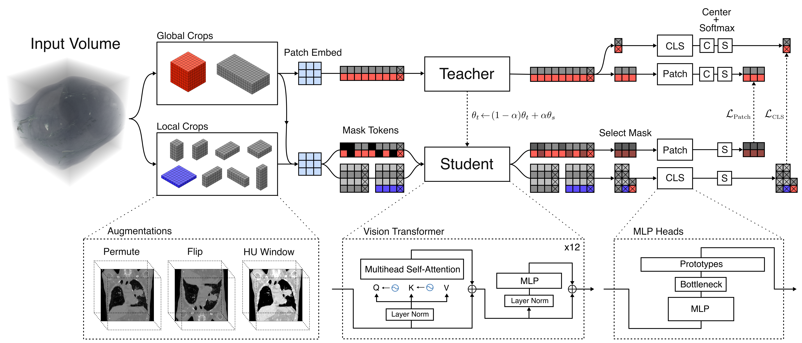

# VoxelFM: Learning Robust Visual Features in Computed Tomography Enables Efficient Transfer Learning for Clinical Tasks

VoxelFM is a foundation model for CT imaging, trained using a self-distillation framework adapted from [DINO](https://github.com/facebookresearch/dinov2) for 3D volumes. It learns clinically useful visual features and transfers efficiently to a wide range of tasks using frozen backbone representations and lightweight probes. 



## Environment Setup

For pretraining and running most evaluations:
```bash
conda create -n voxelfm python=3.12
conda activate voxelfm
pip install torch torchvision
conda install ipykernel
pip install -r requirements.txt
```

To train a vision language model a few additional modules are needed.
```bash
conda install -c nvidia cuda-toolkit
pip install deepspeed
pip install flash-attn --no-build-isolation
```


## Inference

You can use `extract_features` to automatically handle loading, preprocessing, and embedding extraction. You may provide it a path to a dicom, nifti, numpy array, or pytorch tensor. You may also provide a numpy array or pytorch tensor directly. If using an array, please note that it must be in isotropic spacing. The return type is a `VoxelFeatures` dataclass with a global representation (CLS token), patch tokens, and the preprocessed volume. 

### Options

| Argument | Type | Default | Description |
|---|---|---|---|
| `crop_background` | `bool` | `False` | Attempts to crop the volume to remove air/table. |
| `max_patches` | `int` | `None` | Downsample the volume so the total patch count stays within this budget. |

### Example
```python
import torch
import numpy as np
from omegaconf import OmegaConf
from huggingface_hub import hf_hub_download
from dinov2.inference import build_model, extract_features

checkpoint_path = hf_hub_download("rmaguado/voxelFM", "vitb_3d/checkpoints/99999.pth")
config_path = hf_hub_download("rmaguado/voxelFM", "vitb_3d/config.yaml")

config = OmegaConf.load(config_path)
device = torch.device("cuda")
model = build_model(checkpoint_path, config, device=device)

# from a file path (NIfTI or DICOM directory)
features = extract_features(model, config, "path/to/ct/folder_or_file", device)

# from a pre-processed array or tensor (must be isotropic)
volume = np.load("volume.npy")
features = extract_features(model, config, volume, device)

cls_token = features.cls
patch_tokens = features.patch 
```
